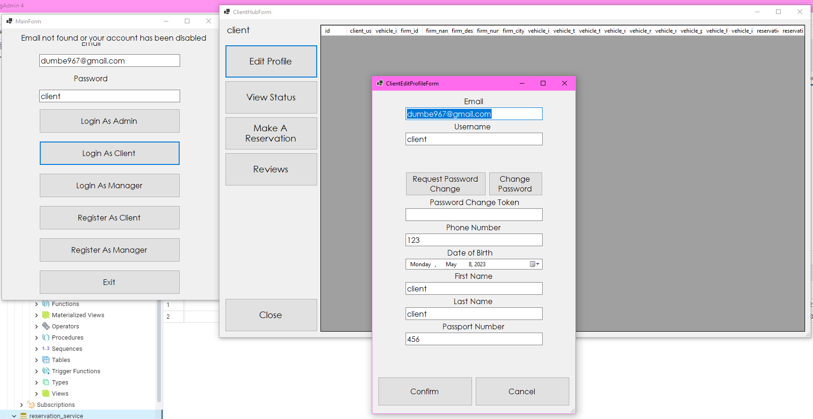
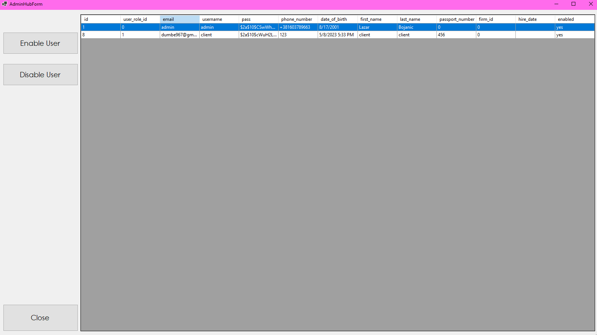

# snowflake

A Java Spring microservices app, that enables the user to manage their reservations in a car rental shop. It uses activemq as the message broker, c# winforms for the client, postgresql database, eureka and api gateway, split into multiple microservices (eureka, api gateway, user service, reservation service, notification service and message broker, client). It has 3 types of users: admin, manager and client. Client is the regular user which makes reservations, and can change their profile. Manager has more permissions, and can modify certain things, and admin has full control, and can disable and enable users. The notification service also sends a confirmation email when a user registers, in order to activate their account.

 
